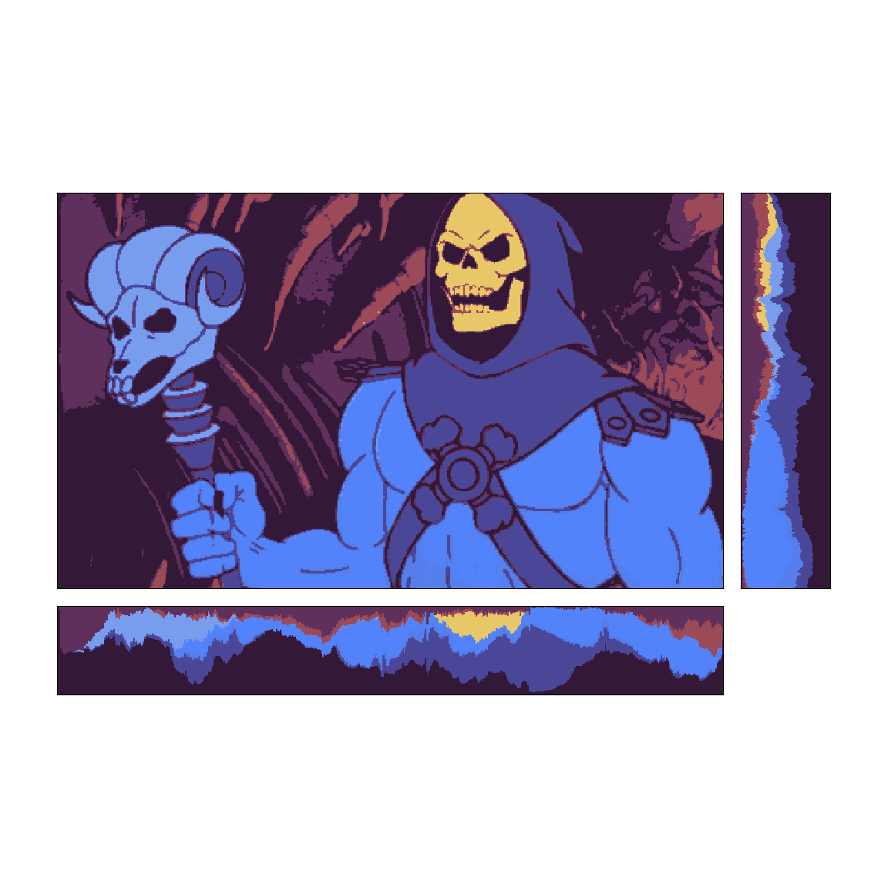

<!-- README.md is generated from README.Rmd. Please edit that file -->

# Image colour distributions

-   **This is an EXPERIMENTAL piece of code that needs more work and
    testing**
-   I am no longer developing it, but wanted to share it here in case it
    provides a useful starting point for someone else…

``` r
library(tidyverse)
library(magick)
library(grid)
```

-   Read image, resize and reduce colours for demonstration purposes.
-   Convert to a raster dataframe

``` r
ncols <- 8

i <- 
  image_read('https://www.denofgeek.com/wp-content/uploads/2014/06/skeletor.jpg?fit=620%2C368') %>% 
  image_resize("500x") %>% 
  image_quantize(max = ncols, dither = FALSE) %>%
  image_raster()
```

-   Store image width, height and aspect ratio for use later on

``` r
w <- max(i$x)
h <- max(i$y)
asp <- h/w
```

-   Order the colours based on similarity in RGB space using the
    Travelling Salesman Problem (TSP)
    -   The idea for this comes from [a stack overflow
        question](https://stackoverflow.com/questions/61193516/how-to-sort-colours-in-r)
    -   This makes the colour proportion summaries look more pretty with
        similar colours grouped together
    -   I have tried other variations such as ordering by hue or
        lightness/darkness but nothing looked as good

``` r
library(TSP)
#> Warning: package 'TSP' was built under R version 3.6.3

# Unique colours in reduced colour image
unique_cols <- unique(i$col)

# Return a vector from the TSP code that allows me to sort the colours
set.seed(1)

col_order <-
 unique_cols %>% 
  col2rgb() %>% 
  t() %>% 
  dist() %>% 
  as.TSP() %>% 
  solve_TSP(control = list(repetitions = 1000))
#> Warning: executing %dopar% sequentially: no parallel backend registered

# Turn colour into factor with levels TSP order
i <- i %>% mutate(col = factor(col, levels = unique_cols[col_order])) %>% as_tibble()
```

-   Create the image raster and bar chart plots

``` r
main <- 
  ggplot(i) +
  geom_raster(aes(x, y, fill=I(col)))+
  coord_equal()+
  theme_void()+
  scale_x_continuous(expand = expansion(0,0))+
  scale_y_reverse(expand = expansion(0,0))

xbar <-
  i %>% 
  count(x, col) %>% 
  mutate(x = factor(x)) %>% 
  ggplot()+
  geom_col(aes(x, n, fill=I(col)), width = 1)+
  theme_void()+
  scale_x_discrete(expand = expansion(0,0))+
  scale_y_reverse(expand = expansion(0,0))

ybar <-
  i %>% 
  count(y, col) %>% 
  mutate(x = factor(y)) %>% 
  ggplot()+
  geom_col(aes(y, n, fill=I(col)), width=1)+
  coord_flip()+
  theme_void()+
  scale_x_reverse(expand = expansion(0,0))+
  scale_y_continuous(expand = expansion(0,0))
```

-   Define grid page and dimensions for the different sections and draw
    all components

``` r
# Define proportional sizes for the main image, the buffer between image and 
# summary and the summary panels
width <- 0.75 
buffer <- 0.02 
vertical_strip <- 0.1
horizontal_strip <- 0.1

# Define the new page and the grid panel viewport
grid.newpage()
pushViewport(
  viewport(
    width = unit(1, "snpc"),
    height = unit(1, "snpc"),
    layout=
      grid.layout(nrow = 3,
                  ncol = 3,
                  widths = unit(c(ifelse(w >= h, width, width/asp), 
                                  buffer, 
                                  vertical_strip), 
                                "snpc"),
                  heights = unit(c(ifelse(w >= h, width*asp, width),
                                   buffer, 
                                   horizontal_strip), 
                                 "snpc"))))

# Draw the image
pushViewport(viewport(layout.pos.row = 1, layout.pos.col = 1))
grid.draw(ggplotGrob(main))
grid.rect(gp = gpar(fill=NA, col=1))
popViewport()

# Draw the horizontal summaries on the right
pushViewport(viewport(layout.pos.row = 1, layout.pos.col = 3))
grid.draw(ggplotGrob(ybar))
grid.rect(gp = gpar(fill=NA, col=1))
popViewport()

# Draw the vertical summary at the bottom
pushViewport(viewport(layout.pos.row = 3, layout.pos.col = 1))
grid.draw(ggplotGrob(xbar))
grid.rect(gp = gpar(fill=NA, col=1))
popViewport()
```

<!-- -->
